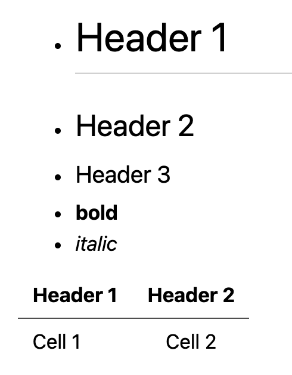
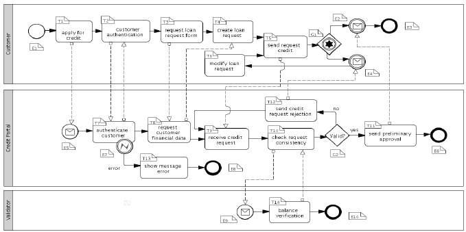
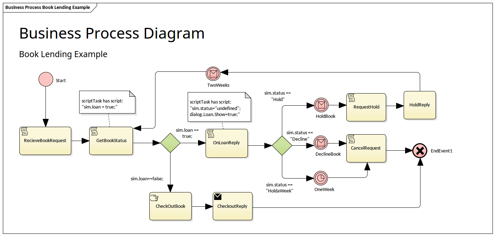
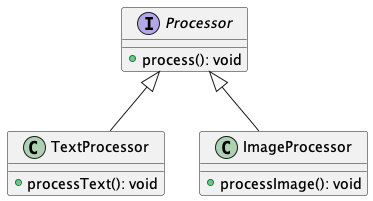
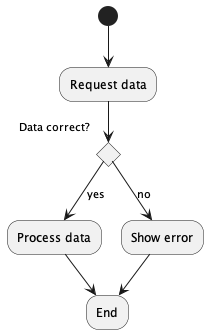
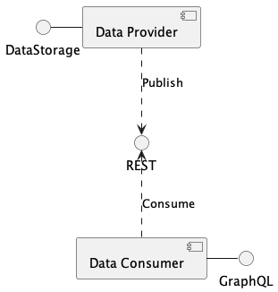

<!-- _backgroundColor: #1a1a1a -->
<!-- _color: white -->


# Documentation as Code

Aleksandr Barmin
May 2022

---

<!-- _backgroundColor: #1a1a1a -->
<!-- _color: white -->


# Aleksandr Barmin

- Chief Software Engineer I
- AWS Solution Architect Associate
- AWS Developer Associate

Aleksandr_Barmin@epam.com

---

<!-- _backgroundColor: #1a1a1a -->
<!-- _color: white -->


# Agenda

- Importance of documentation
- Markdown
- PlantUML
- Marp
- Examples and demos

---


# Importance of documentation

Documentation is important:

- a single source of truth
- essential for quality and process control
- cuts down duplicative work
- makes hiring and onboarding easier
- a single source of truth makes everybody smarter

<!--

https://www.atlassian.com/work-management/knowledge-sharing/documentation/importance-of-documentation

It is not a secret that people spend a lot of time just googling or trying to find the most up to date information.

Effective documentation collects all of the must-know information about a task, project, or team (from account logins to step-by-step instructions) in a centralized, organized place. No more digging through email or downloaded files for the latest information.

When you’re handing off a task, planning for a new project, or need to have a different team member step in on something, documentation means you’re able to keep the gears turning without spending hours trying to track down details, credentials, directions, and more.

Writing down your processes is helpful for spotting bottlenecks and bloated workflows, so you can further streamline the way your team works.

--

There’s more than one way to get things done, and you want to give your team the flexibility to approach their work in a way that suits them best.

But, at the same time, you want to ensure consistent results – especially when it comes to things that you’re producing on a regular basis. There needs to be some level of cohesion so that you don’t look sloppy or uninformed.

Documentation encourages knowledge sharing, which empowers your team to understand how processes work and what finished projects typically look like.

With those resources in hand, your team members don’t need to be mind readers to maintain consistency of repeated projects like that monthly report or that quarterly presentation. They still have wiggle room to get creative while confirming that they’re checking all of the must-have boxes.

--

How many times have you started a new project only to find out it had been done before? Companies that use documentation to catalog past projects, collect research, and share decisions benefit by reducing re-work that wastes precious time you could be using elsewhere.

Why reinvent the wheel when you can just build on the work that’s already happened? With documentation in place, you can refer to past work and learn from it, instead of doing it all over again with the same results.

--

You want to educate and empower team members to do their best work, rather than making them feel like they’re thrown to the wolves.

If you prioritize documentation, they’ll have all sorts of helpful guides, directions, and notes that they can refer to as they get up to speed in their new roles. Plus, they can use those resources to answer their questions and start to figure things out independently, rather than feeling like they need to ping someone on your team with every single question or sticking point.

--

At work, we tend to treat our knowledge as currency. If we’re the person with all of the answers, it provides us a sense of security, as if we’re the most irreplaceable person on our team. We assume that sharing our expertise will make us less valuable.

Documentation increases the collective knowledge of everyone that you work with. When it becomes the norm on your team to share information, you’ll benefit from increased transparency and a culture that’s more collaborative and strategic. You’ll make smarter decisions because essential information won’t be locked away on just one person’s hard drive - or worse yet - their head.

-->

---


# Documentation for software

For text:

- Code (JavaDoc, PyDoc, etc.)
- Confluence
- SharePoint (literally, MS Word)

For diagrams:

- Draw.io
- Lucidchart
- MS Visio

---


# When documentation is not (only) code

- Different software for different types of content
- Incompatible software
- Tracking of history of changes is complicated
- Consistent styling is complicated

---


# Documentation as code

https://www.writethedocs.org/

Documentation as Code (Docs as Code) refers to a philosophy that you should be writing documentation with the same tools as code:

- Issue Trackers
- Version Control (ex git)
- Plain Text Markup
- Code Reviews
- Automated Tests

---


# Plain Text Markup

- HTML
- Docbook
- DITA
- reStructuredText
- TeX and LaTeX
- Markdown
- Asciidoc

---


# Markdown

https://www.markdownguide.org/

- Lightweight
- Portable
- Platform independent
- Independent from apps
- It's everywhere already!

---


# Markdown Example

```

- # Header 1
- ## Header 2
- ### Header 3
- **bold**
- *italic*

| Header 1 | Header 2 |
| :--------| :------: |
| Cell 1   | Cell 2   |

```
---


# Asciidoc

https://asciidoc.org/

- Automatic TOC
- Includes
- Audio/View
- Keyboard, button, and menu macros
- Admonitions
- Better tables
- Document attributes
- Bibliography
- Footnotes

---


# Asciidoc Example

```
----
This is a code listing
----

.This is a text accordion
[%collapsible]
====
This text is hidden inside
====
```
---


# How to write

- VSCode
- IntelliJ
- GitHub and GitLab
- Jira and Confluence

---


# How to write

- MS Teams
- Notion
- MacDown, iA Writer or Marked 2
- Obsidian, Notable, Bear, Joplin

---


# Modelling notations

- BPMN
- IDEF
- UML


---


---


# Drawing UML

- PlantUML
- Mermaid
- yUML
- Nomnoml
- TextUML
- UML Graph
- Asciidoctor Diagram

---


# Sequence diagram

```
@startuml Sequence

actor Client
participant System
participant 3rdParty

Client -> System: Request
    System -> 3rdParty: API call
    alt ok
        3rdParty -> System: Data
    else error
        3RdParty -> System: Error
    end 
System -> Client: Response

@enduml
```

---


# Class diagram

```
@startuml example-4

interface Processor {
    + process(): void
}
class TextProcessor {
    + processText(): void
}
class ImageProcessor {
    + processImage(): void
}

TextProcessor -up-|> Processor
ImageProcessor -up-|> Processor

@enduml
```

---


# Activity diagram

```
@startuml example-5

(*) --> Request data

if "Data correct?" then
    --> [yes] Process data
    --> End
else
    --> [no] Show error
    --> End
endif

@enduml
```

---


# Component diagram

```
@startuml example-6

DataStorage - [Data Provider]
[Data Provider] .down.> REST: Publish

[Data Consumer] .up.> REST: Consume
[Data Consumer] - GraphQL

@enduml
```
---


# Slides as Text

- reveal.js
- Marp
- Remark
- Cleaver

---


# Summary

- Documentation is important
- Plain text `->` docx, pdf
- PlantUML `->` png
- Marp `->` pptx, pdf

https://github.com/aabarmin/epam-documentation-as-code-examples-2022